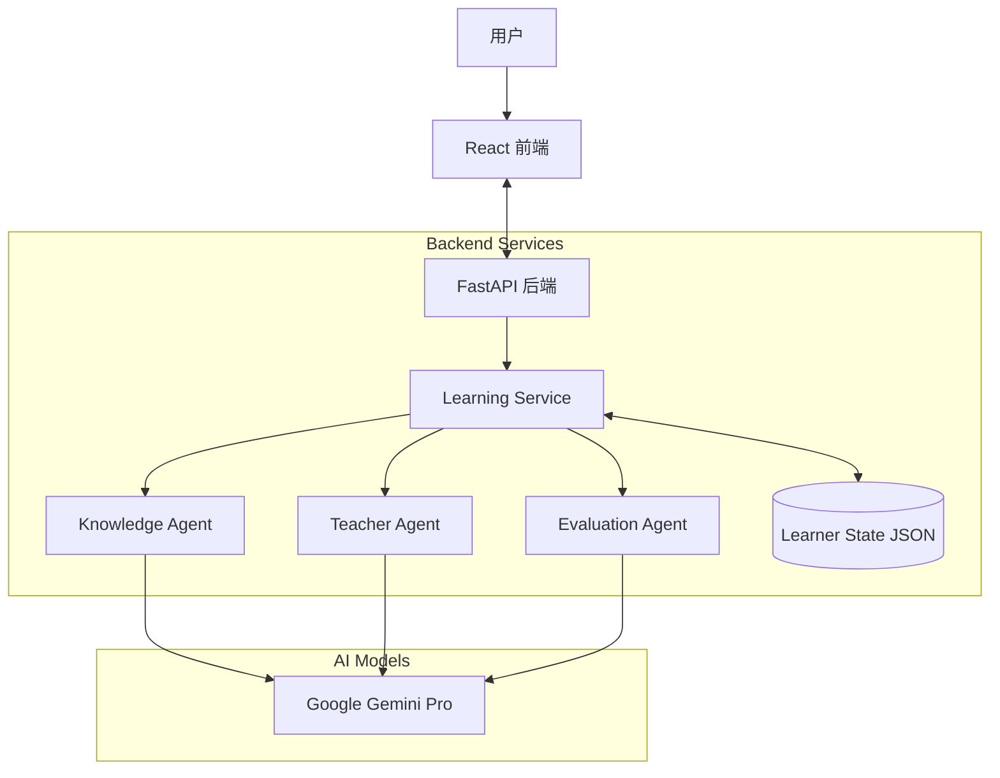

<p align="center">
  
  
  
  
  
  
</p>

<h1 align="center">🌟 AstraMentor</h1>

<p align="center">
  <strong>通过 AI 驱动的交互式知识星图，重新定义你的学习方式。</strong>
</p>

<p align="center">
  AstraMentor 是一个基于多 Agent 架构的全栈 AI 编程教学系统。它不只是一个聊天机器人，而是一位能够感知你需要学什么、该怎么学、并实时跟踪你学习状态的智能私教。
</p>

<br/>

## ✨ 核心特性 (Key Features)

<table>
<tr>
<td width="50%">

### 🌌 动态知识星图 (Knowledge Graph)

拒绝线性死板的教程。系统根据你的学习目标，实时生成可视化的**知识依赖图谱**。

- **性能优化**: 采用 AntV G6 高性能渲染引擎，流畅支持海量节点展示
- **3D星空图谱**: 一键切换 3D 力导向图谱视图，在立体的星空背景中探索知识
- **智能交互**: 点击节点高亮关联路径，清晰展示知识脉络，支持灵活的鼠标拖拽与漫游
- **视觉升级**: 动态发光效果、平滑曲线连接，配合实时掌握度（彩色填充）状态展示
- **多语言适配**: 界面元素全方位支持中英文双语切换，满足不同语言习惯
- **灵活布局**: 2D 模式下支持纵向/横向布局一键切换，支持自适应视口居中定位

</td>
<td width="50%">

### 💬 沉浸式多模态教学 (Multimodal AI)

- **人格化教学**: AI 会根据你的水平自动切换角色（从幽默的"科普作家"到严谨的"资深架构师"）。
- **多模态支持**: 支持**图片上传**。遇到看不懂的代码或数学公式？截图发给 AI，它能精准识别并解析。
- **在线 IDE**: 内置**代码编辑器**，支持 Python, JavaScript, Go, C, C++, Java 六种语言。直接在浏览器中编写并运行代码，验证你的学习成果。

</td>
</tr>
<tr>
<td width="50%">

### 🔄 闭环式学习流 (Interactive Loop)

独创的 **Teach-Confirm-Quiz-Evaluate** 闭环：

1.  **教学**: AI 深入浅出地讲解概念。
2.  **确认**: 询问你是否听懂（"没明白，再讲一遍" vs "明白，开始检测"）。
3.  **测验**: 生成针对性的选择题或代码题。
4.  **评估**: 如果你只选了"C"，AI 也能判断对错，并更新你的**真实掌握度**。

</td>
<td width="50%">

### 📊 智能学习画像 (Learner Profile)

- **实时仪表板**: 左侧 Dashboard 实时显示你的学习进度曲线（支持折叠收起）。
- **EMA 算法**: 使用指数移动平均算法（EMA）计算掌握度，防止"临时抱佛脚"式的虚假学会，更看重长期记忆与理解。
- **持久化**: 你的每一次对话、每一个知识点的状态都会被保存。

</td>
</tr>
<tr>
<td width="50%">

### 🛡️ 沉浸体验与护眼 (Focus & Eye Care)

- **复古像素白昼**: 白天模式创新融合了经典复古像素艺术（Pixel Art）风格、粗黑框元素与像素字体，带来别致操作体验。
- **暖色护眼阅读**: 一键切换米黄色暖调护眼主题（Eye-Care），适配沉浸式长篇教学阅读，减轻视觉疲劳。
- **可调节布局**: 面板宽度随意拖拽，配合柔和的响应式动态组件。

</td>
<td width="50%">

### 🧠 多 Agent 协同架构

- **Knowledge Agent**: 负责构建知识图谱结构。
- **Teacher Agent**: 负责根据教学大纲输出内容。
- **Evaluation Agent**: 独立于教学 Agent，负责客观评分与分析。
- **Code Runner**: 负责在后端安全沙箱中执行用户代码。

</td>
</tr>
</table>

---

## 🏗️ 系统架构 (Architecture)



---

## 🚀 快速开始 (Quick Start)

### 前置要求

- **Python**: 3.10 或更高版本
- **Node.js**: 16.0 或更高版本
- **Google API Key**: 需要开通 Gemini API 权限
- **Compilers** (可选, 用于在线 IDE):
  - GCC (C/C++)
  - Go
  - JDK (Java)

### 1️⃣ 后端环境设置

```bash
# 1. 克隆项目并进入目录
git clone https://github.com/maxwell-orange/AstraMentor-v1.git
cd AstraMentor-v1

# 2. 创建虚拟环境
python -m venv .venv
# Windows:
.venv\Scripts\activate
# Linux/macOS:
source .venv/bin/activate

# 3. 安装依赖
pip install -r requirements.txt

# 4. 配置环境变量
# 复制 .env.example 为 .env，填入你的 GOOGLE_API_KEY
copy .env.example .env

# 5. 启动后端服务
uvicorn backend.app:app --reload
```

后端服务将在 `http://127.0.0.1:8000` 启动。

### 2️⃣ 前端环境设置

```bash
# 1. 打开新的终端窗口，进入 frontend 目录
cd frontend

# 2. 安装依赖
npm install

# 3. 启动开发服务器
npm run dev
```

前端应用将在 `http://localhost:5173` 启动。

---

## 📖 使用说明 (User Guide)

1.  **启动探索**: 在顶部搜索框输入你想学习的主题（例如 `"Python 装饰器"` 或 `"Transformer 架构"`）。
2.  **生成图谱**: 系统会生成该主题的知识星图。
3.  **选择路径**: 点击图中任意一个节点（推荐从左上角或中心节点开始）。
4.  **开始授课**: 右侧聊天窗口会显示 AI 导师的教学内容。
5.  **互动反馈**:
    - 如果没听懂，点击 **"🤔 没明白，再讲一遍"**。
    - 如果懂了，点击 **"✅ 明白，开始检测"**。
6.  **完成测验**:
    - AI 会出一道题。
    - 你可以直接回复选项字母（如 "A"），也可以详细解释。
    - AI 会根据你的回答给出评分（0-100%）和详细解析。
7.  **实践编程**: 点击顶部 **"IDE"** 按钮打开代码编辑器，选择语言并运行代码，进行实战练习。
8.  **查看成长**: 观察左侧仪表板，看着你的掌握度一点点上涨！

---

## 📁 项目结构 (Directory Structure)

```
AstraMentor-v1/
├── 📂 agents/                  # AI Agents (Teacher, Evaluation, Knowledge)
├── 📂 backend/                 # FastAPI 后端核心代码
│   ├── api.py                 # API 路由定义
│   ├── app.py                 # 应用入口
│   └── models.py              # Pydantic 数据模型
├── 📂 core/                    # 核心逻辑 (Prompts, Scoring, State)
├── 📂 frontend/                # React 前端代码
│   ├── src/
│   │   ├── features/chat/     # 聊天与互动组件
│   │   ├── features/graph/    # 知识图谱组件 (AntV G6)
│   │   └── api/               # Axios API 客户端
├── 📂 services/                # 业务逻辑层 (连接 API 与 Agents)
├── 📂 user_data/               # 用户学习数据持久化目录
├── requirements.txt            # Python 依赖列表
└── README.md                   # 项目文档
```

---

## 🤝 贡献 (Contributing)

欢迎提交 Issue 和 Pull Request！如果你有更好的 Prompt 策略或新的功能想法，请随时告诉我们需要改进的地方。

1.  Fork 本仓库
2.  新建分支 (`git checkout -b feature/AmazingFeature`)
3.  提交更改 (`git commit -m 'Add some AmazingFeature'`)
4.  推送到分支 (`git push origin feature/AmazingFeature`)
5.  提交 Pull Request

---

## 📝 许可证 (License)

本项目基于 [AGPL v3 License](LICENSE) 开源。

---

<p align="center">
  Made with ❤️ by the AstraMentor Team
</p>
