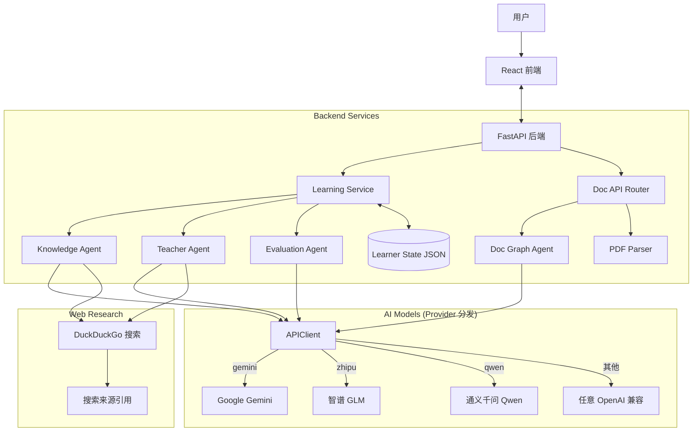

<p align="center">
  
  
  
  
  
  
  
  
</p>

<h1 align="center">🌟 AstraMentor</h1>

<p align="center">
  <strong>通过 AI 驱动的交互式知识星图，重新定义你的学习方式。</strong>
</p>

<p align="center">
  AstraMentor 是一个基于多 Agent 架构的全栈 AI 教学系统。它不只是一个聊天机器人，而是一位能够感知你需要学什么、该怎么学、并实时跟踪你学习状态的智能私教。支持两种模式：<strong>主题模式</strong>（输入任意主题自由学习）和<strong>文档模式</strong>（上传 PDF 文件精读论文/教材）。
</p>

<br/>

## ✨ 核心特性 (Key Features)

### 🌌 动态知识星图 (Knowledge Graph)

拒绝线性死板的教程。系统根据你的学习目标，实时生成可视化的**知识依赖图谱**。

- **性能优化**: 采用 AntV G6 高性能渲染引擎，流畅支持海量节点展示
- **3D星空图谱**: 一键切换 3D 力导向图谱视图，在立体的星空背景中探索知识
- **智能交互**: 点击节点高亮关联路径，清晰展示知识脉络，支持灵活的鼠标拖拽与漫游
- **视觉升级**: 动态发光效果、平滑曲线连接，配合实时掌握度（彩色填充）状态展示
- **图谱扩展**: 支持用户**手动添加节点**，AI 智能分析现有图谱，自动生成适当的中间过渡节点并建立自然递进的层次连接
- **复杂度控制**: 生成星图时可通过分段滑块选择**3 档知识深度**（简洁 4~7 节点 / 标准 8~12 节点 / 详细 13~20 节点），按需定制图谱规模
- **多语言适配**: 界面元素全方位支持中英文双语切换，满足不同语言习惯
- **灵活布局**: 2D 模式下支持纵向/横向布局一键切换，支持自适应视口居中定位

### 💬 自适应多模态教学 (Adaptive AI Teaching)

- **5 档自适应教学**: AI 根据你的掌握度（0%~100%）自动调整 4 个维度——讲解深度、代码要求、表达方式、术语使用，从通俗类比到源码级剖析无缝过渡
- **计划驱动教学**: 每个知识点会先生成 3-6 步教学计划，按步骤递进学习，确保知识点覆盖完整
- **多模态支持**: 支持**图片上传**。遇到看不懂的代码或数学公式？截图发给 AI，它能精准识别并解析
- **在线 IDE**: 内置**代码编辑器**，支持 Python, JavaScript, Go, C, C++, Java 六种语言，直接在浏览器中编写并运行代码

### 🔄 步骤化教学闭环 (Step-by-Step Loop)

独创的 **Plan → Teach → Quiz → Evaluate → Next** 闭环：

1.  **生成计划**: AI 根据知识点和前驱依赖，生成 3-6 步递进教学计划
2.  **逐步讲解**: 每步只讲当前步骤内容，不超前不遗漏
3.  **步骤测验**: 每步讲完后由独立的评估 Agent 出题验证
4.  **双层评分**: 步骤分独立记录，全局掌握度通过加权聚合计算（后面步骤权重更大）
5.  **针对性重讲**: 答错可基于错误分析精准重讲，通过后进入下一步

### 📊 智能学习画像 (Learner Profile)

- **实时仪表板**: 左侧 Dashboard 实时显示你的学习进度曲线（支持折叠收起）
- **双层评分算法**: 每步测验分独立记录（`step_scores`），全局掌握度 = 加权平均 × 完成度系数 × 目标掌握度，杜绝"还没学完就高分"
- **5 档反馈体系**: 🌱 还需努力 → 💡 有所领悟 → 📖 基本掌握 → 💪 表现不错 → 🌟 非常出色
- **持久化**: 你的每一次对话、每一个知识点的状态、教学计划和步骤分数都会被保存

### 🛡️ 沉浸体验与护眼 (Focus & Eye Care)

- **复古像素白昼**: 白天模式创新融合了经典复古像素艺术（Pixel Art）风格、粗黑框元素与像素字体，带来别致操作体验
- **暖色护眼阅读**: 一键切换米黄色暖调护眼主题（Eye-Care），适配沉浸式长篇教学阅读，减轻视觉疲劳
- **可调节布局**: 面板宽度随意拖拽，配合柔和的响应式动态组件

### 🔍 联网搜索增强 (Web Research)

- **实时搜索**: 教学和讨论环节自动通过 DuckDuckGo 搜索引擎获取最新资料
- **搜索来源展示**: AI 回复下方展示可点击的搜索来源卡片，方便追溯原文
- **星图智能预研**: 生成知识图谱和扩展节点时先搜索最新知识结构，让图谱更准确
- **零配置**: 默认启用，可通过 `.env` 中 `ASTRA_WEB_SEARCH_ENABLED=false` 关闭
- **容错回退**: 搜索失败时自动回退到无搜索模式，不影响正常功能

### 🧠 多 Agent 协同架构

- **Knowledge Agent**: 负责构建知识图谱结构，支持 3 档复杂度动态提示词
- **Doc Graph Agent**: 负责基于文档内容构建文档专属星图 [NEW]
- **Teacher Agent**: 负责按教学计划逐步输出教学内容（禁止出题）
- **Evaluation Agent**: 独立于教学 Agent，负责出题、评分与错误分析
- **Code Runner**: 负责在后端安全沙箱中执行用户代码

### 📄 文档模式 (Document Mode)

上传 PDF 文件（论文、教材、技术文档），AI **严格围绕文档原文**帮你读懂每一页。

- **PDF 智能解析**: PyMuPDF 提取文本，按段落/章节自动分块，保留页码和标题
- **文档专属星图**: 基于文档内容生成知识图谱，每个节点关联原文分块
- **原文强关联**: 所有教学、出题、评分都必须引用原文，禁止超出文档范围
- **统一入口**: 主题/文档模式通过同一对话框 Tab 页切换，共享水平/用途/深度
- **拖拽上传**: 支持拖拽或点击上传 PDF 文件，最大 50MB

### ⚙️ 评分算法详解

**双层评分机制（有教学计划时）：**

```
step_scores[i] = AI 评分   # 每步独立记录

weights = [1.0, 1.5, 2.0, 2.5, ...]  # 后面步骤权重递增
weighted_avg = Σ(score × weight) / Σ(weight)
completion_factor = 已完成步骤数 / 总步骤数
actual_mastery = weighted_avg × completion_factor × target_mastery
```

**EMA 评分（无教学计划时）：**

```
A_new = A_old × β + α × (S × W_cap - A_old × β) × γ
```

---

## 🏗️ 系统架构 (Architecture)



---

## 🚀 快速开始 (Quick Start)

### 前置要求

- **Python**: 3.10 或更高版本
- **Node.js**: 16.0 或更高版本
- **AI 模型 API Key**（任选一个即可）：

  | 提供商 | 模型示例 | 获取方式 |
  |--------|----------|----------|
  | Google Gemini | `gemini-2.5-flash` | [Google AI Studio](https://aistudio.google.com/) |
  | 智谱 AI (GLM) | `glm-5` | [智谱开放平台](https://open.bigmodel.cn/) |
  | 通义千问 (Qwen) | `qwen3.5-plus` | [阿里云百炼](https://dashscope.aliyun.com/) |
  | 其他 OpenAI 兼容 | — | 只需 API Key + Endpoint 即可 |

- **Compilers** (可选, 用于在线 IDE):
  - GCC (C/C++)
  - Go
  - JDK (Java)

### 1️⃣ 后端环境设置

```bash
# 1. 克隆项目并进入目录
git clone https://github.com/maxwell-orange/AstraMentor-v1.git
cd AstraMentor-v1

# 2. 创建虚拟环境
python -m venv .venv
# Windows:
.venv\Scripts\activate
# Linux/macOS:
source .venv/bin/activate

# 3. 安装依赖
pip install -r requirements.txt

# 4. 配置环境变量
# 复制 .env.example 为 .env，填入你的模型提供商和 API Key
copy .env.example .env
# 编辑 .env，设置 ASTRA_PROVIDER / ASTRA_API_KEY / ASTRA_API_ENDPOINT / ASTRA_MODEL_NAME
# 可选：关闭联网搜索功能
# 在 .env 中设置 ASTRA_WEB_SEARCH_ENABLED=false

# 5. 启动后端服务
uvicorn backend.app:app --reload
```

#### 环境变量配置示例

```env
# ========== 使用 Gemini ==========
ASTRA_PROVIDER=gemini
ASTRA_API_KEY=your-gemini-key
ASTRA_API_ENDPOINT=https://generativelanguage.googleapis.com
ASTRA_MODEL_NAME=gemini-2.5-flash

# ========== 使用智谱 GLM ==========
ASTRA_PROVIDER=zhipu
ASTRA_API_KEY=your-zhipu-key
ASTRA_API_ENDPOINT=https://open.bigmodel.cn/api/paas/v4/
ASTRA_MODEL_NAME=glm-5

# ========== 使用通义千问 Qwen ==========
ASTRA_PROVIDER=qwen
ASTRA_API_KEY=your-qwen-key
ASTRA_API_ENDPOINT=https://dashscope.aliyuncs.com/compatible-mode/v1
ASTRA_MODEL_NAME=qwen3.5-plus
```

后端服务将在 `http://127.0.0.1:8000` 启动。

### 2️⃣ 前端环境设置

```bash
# 1. 打开新的终端窗口，进入 frontend 目录
cd frontend

# 2. 安装依赖
npm install

# 3. 启动开发服务器
npm run dev
```

前端应用将在 `http://localhost:5173` 启动。

---

## 📖 使用说明 (User Guide)

1.  **启动探索**: 在顶部搜索框输入你想学习的主题（例如 `"Python 装饰器"` 或 `"Transformer 架构"`）
2.  **生成图谱**: 系统会弹出星图生成对话框，可选择**知识深度**（简洁 / 标准 / 详细）后生成
3.  **选择路径**: 点击图中任意一个节点（推荐从根节点开始）
4.  **生成教学计划**: 系统会为该知识点生成 3-6 步递进教学计划
5.  **逐步学习**:
    - 每步 AI 会按当前掌握度选择合适的深度进行讲解
    - 讲完后点击 **"✅ 明白，开始检测"** 进入步骤测验
    - 答对后点击 **"➡️ 下一步"** 进入下一个教学步骤
    - 答错可点击 **"🔄 针对错误重新讲解"** 精准补强
6.  **实践编程**: 点击顶部 **"IDE"** 按钮打开代码编辑器，选择语言并运行代码，进行实战练习
7.  **查看成长**: 观察左侧仪表板和星图节点颜色变化，掌握度随步骤推进逐渐上涨

### 📄 文档模式使用步骤

1.  打开星图生成对话框，切换到 **"文档模式"** Tab 页
2.  拖拽或点击上传 PDF 文件（支持论文、教材等，最大 50MB）
3.  可选填写当前水平和学习用途，选择知识深度，点击 **"开始分析"**
4.  系统解析 PDF 并生成文档知识星图，后续教学和出题均严格引用原文

---

## 📁 项目结构 (Directory Structure)

```
AstraMentor-v1/
├── 📂 agents/                  # AI Agents
│   ├── knowledge_graph_agent.py  # 主题模式星图 Agent
│   └── doc_graph_agent.py        # 文档模式星图 Agent [NEW]
├── 📂 backend/                 # FastAPI 后端核心代码
│   ├── api.py                 # 主题模式 API 路由
│   ├── doc_api.py             # 文档模式 API 路由 [NEW]
│   ├── app.py                 # 应用入口（注册双路由）
│   └── models.py              # Pydantic 数据模型
├── 📂 core/                    # 核心逻辑
│   ├── prompts.py             # 主题模式 5 档教学/评分提示词
│   ├── doc_prompts.py         # 文档模式专用提示词 [NEW]
│   ├── scoring.py             # 评分算法（双层评分 + EMA）
│   └── learner_state.py       # 学习者状态
├── 📂 models/                  # Pydantic 数据模型
│   └── knowledge_graph.py     # 星图结构化输出模型（含 source_chunks）
├── 📂 services/                # 业务逻辑层
│   ├── learning_service.py    # 教学计划管理、双层评分聚合
│   ├── pdf_parser.py          # PDF 解析服务 [NEW]
│   └── code_runner.py         # 代码沙箱执行
├── 📂 utils/                   # 工具模块
│   ├── api_client.py          # 多模型 Provider 统一客户端（Gemini / GLM / Qwen）
│   └── web_research.py        # 联网搜索 (DuckDuckGo)
├── 📂 frontend/                # React 前端代码
│   ├── src/
│   │   ├── components/ui/     # 通用 UI 组件
│   │   ├── components/        # SourceQuoteCard 等
│   │   ├── features/chat/     # 聊天与步骤化交互组件
│   │   ├── features/graph/    # 星图组件 + 统一生成对话框
│   │   ├── features/dashboard/# 学习仪表板
│   │   ├── features/ide/      # 在线代码编辑器
│   │   ├── features/home/     # 首页落地页
│   │   ├── features/sidebar/  # 历史星图侧边栏
│   │   ├── locales/           # 中英文国际化
│   │   └── api/               # Axios API 客户端
├── 📂 test_data/               # 运行时数据（学习状态、图谱 JSON、上传 PDF）
├── config.py                   # 应用配置
├── .env.example                # 环境变量模板
├── requirements.txt            # Python 依赖列表
└── README.md                   # 项目文档
```

---

## 🤝 贡献 (Contributing)

欢迎提交 Issue 和 Pull Request！如果你有更好的 Prompt 策略或新的功能想法，请随时告诉我们需要改进的地方。

1.  Fork 本仓库
2.  新建分支 (`git checkout -b feature/AmazingFeature`)
3.  提交更改 (`git commit -m 'Add some AmazingFeature'`)
4.  推送到分支 (`git push origin feature/AmazingFeature`)
5.  提交 Pull Request

---

## 📝 许可证 (License)

本项目基于 [AGPL v3 License](LICENSE) 开源。

---

<p align="center">
  Made with ❤️ by the AstraMentor Team
</p>
